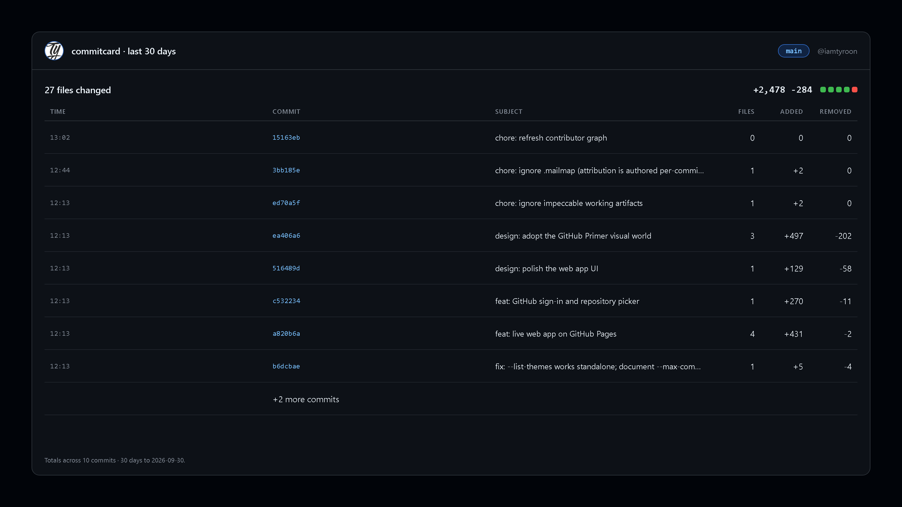

# commitcard

Turn a day or a week of commits into a clean image for Twitter/X, LinkedIn, or a blog post.

`commitcard` reads your commit history, computes the stats exactly the way GitHub does, and
renders a card sized for social. It also handles the noise: large mechanical commits — untracking
build output, deleting generated files — are detected and shown separately, so a cleanup commit
never makes your real work look bigger than it was.

Two frontends, one card renderer:

- **[Try it in the browser](https://iamtyroon.github.io/commitcard)** — type a repo, download the
  PNG. Nothing to install.
- **The CLI** — the full-power path. Private repos, local git, and large ranges.

## The web app

**[iamtyroon.github.io/commitcard](https://iamtyroon.github.io/commitcard)**

Pick a repository, a range, and a size, then download the PNG. It runs entirely client-side —
nothing is uploaded. Sign in to unlock private repositories and pick from your own repos.

| | Signed out | Signed in |
|---|---|---|
| Repositories | public only | public **and private** |
| Commits analysed | 30 | 200 |
| API rate limit | 60 / hour per IP | 5,000 / hour |

The token lives in that tab only (memory + `sessionStorage`), is sent nowhere except
`api.github.com`, and disappears when you close the tab.

## The CLI

Requires Node.js 18+ and a Chromium/Chrome/Edge binary (found automatically, including
Playwright's cached Chromium).

~~~bash
git clone https://github.com/iamtyroon/commitcard.git
cd commitcard
node bin/commitcard.mjs --repo iamtyroon/commitcard 30d
~~~

That writes `commitcard-<date>.png` in the current directory.

> Not published to npm yet — run it from a clone as above, or use the web app.

~~~bash
# today's commits for a repo (uses gh if logged in, else the public API)
node bin/commitcard.mjs --repo iamtyroon/Procureline today --tz 3

# this week, with a title and your handle
node bin/commitcard.mjs --repo vercel/next.js week --handle @you --title "My week in code"

# from a local checkout — no network, works on any repo
node bin/commitcard.mjs --cwd . week --tz 3
~~~

## Where the data comes from

- **GitHub** (`--repo owner/name`) — uses the `gh` CLI when installed, so **private repos work**.
  Otherwise the public API (set `GITHUB_TOKEN` to raise the rate limit).
- **Local git** (`--cwd .`) — reads a directory's history. No network, works offline, any repo.

GitHub history is paginated, so multi-day ranges are exact rather than stopping at 100 commits.
Capped by `--max-commits` (default 1000); when the cap is hit the card says so.

## Ranges

The range is the first positional argument, or `--range`:

| Token | Meaning |
|---|---|
| `today` (default) | today, in your `--tz` timezone |
| `yesterday` | yesterday |
| `week` / `7d` | last 7 days (also draws a per-day histogram) |
| `30d` | last 30 days |
| `month` | current calendar month |
| `all` | entire history |

Or pin exact dates with `--from 2026-09-01 --to 2026-09-29`, or one day with `--date 2026-09-29`.

## Presets

| Preset | Size | Best for |
|---|---|---|
| `twitter` (default) | 1600×900 | Twitter/X timeline, LinkedIn |
| `twitter-square` | 1080×1080 | Instagram, square posts |
| `x-header` | 1500×500 | X profile header |
| `og` | 1200×630 | Open Graph / blog previews |
| `github` | auto | README / issue comments (sized to content) |

Themes: `dark` (default), `light`, `midnight`.

## Options

~~~text
--repo owner/name   GitHub repo to read
--branch <name>     branch (default: the repo's default branch)
--cwd <dir>         read local git history instead
--api gh|http       force the API backend
--tz <hours>        timezone offset for "today" and for times (e.g. 3)

--preset twitter|twitter-square|x-header|og|github
--theme dark|light|midnight
--title <text>      headline (defaults to the repo name)
--subtitle <text>   small line under the title
--label <text>      footer label (e.g. "Week of Sep 22")
--handle <text>     top-right handle (defaults to @owner)
--avatar <url>      avatar image (defaults to the repo owner's)
--note <text>       replace the default footer note
--max-rows <n>      commits listed (default 8)
--max-commits <n>   cap on commits analysed (default 1000)
--no-bulk-tag       hide the "bulk" badge

--out <path>        output PNG (default ./commitcard-<date>.png)
--scale <n>         device scale (default 2)
--json              print stats as JSON, no image
--open              open the PNG when done
~~~

## How bulk detection works

A commit counts as **bulk** when it deletes a lot, adds almost nothing, *and* reads like
maintenance (`chore`, `remove`, `untrack`, `revert`, …). Those commits get a `bulk` badge and are
left out of the "source only" row, so the card shows both the raw diff and the real signal.

## Development

~~~bash
npm test
node bin/commitcard.mjs --repo owner/name today --tz 3
~~~

The web app (`index.html`) and the CLI share `src/render.mjs` and `src/aggregate.mjs`, so a card
looks the same either way. `DESIGN.md` documents the visual system; `PRODUCT.md` the product rules.

## Requirements

- Node.js 18+
- A Chromium/Chrome/Edge binary for rendering — override discovery with `COMMITCARD_BROWSER`
- For private GitHub repos: `gh auth login`, or `GITHUB_TOKEN`

## License

MIT
